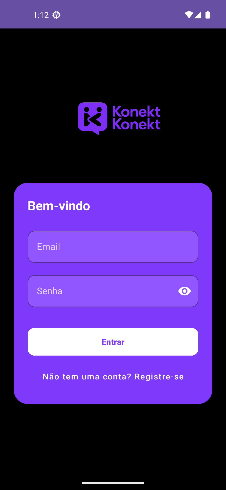
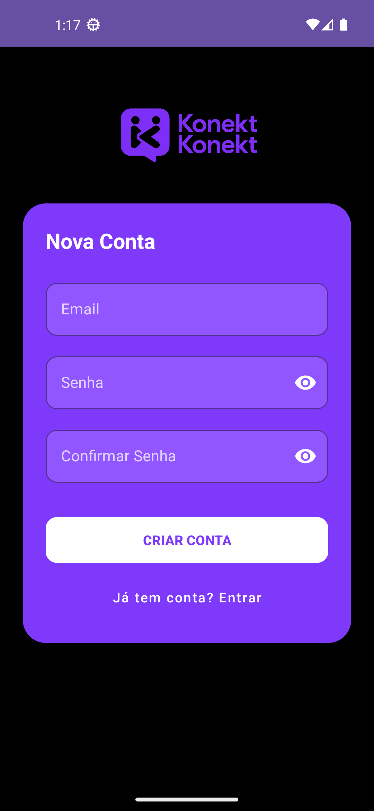
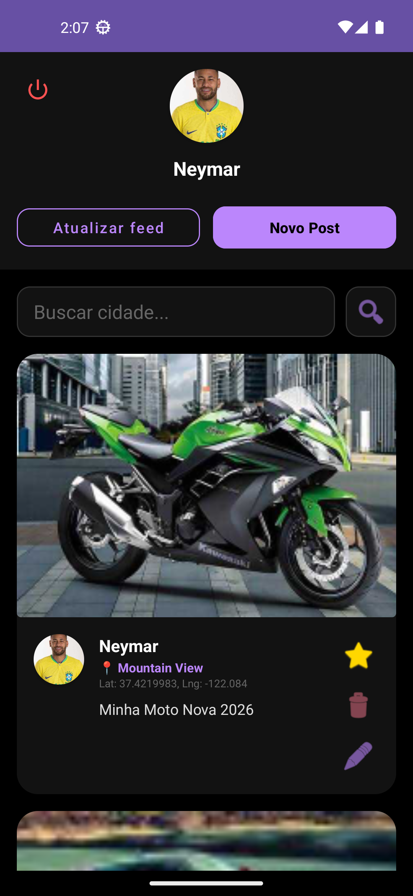
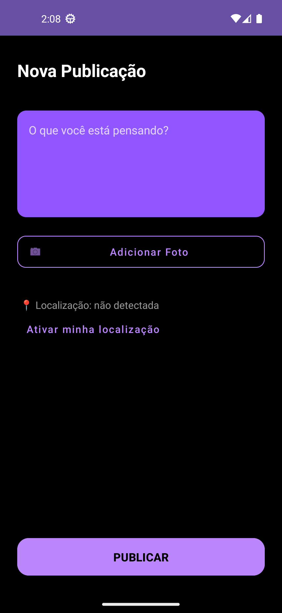
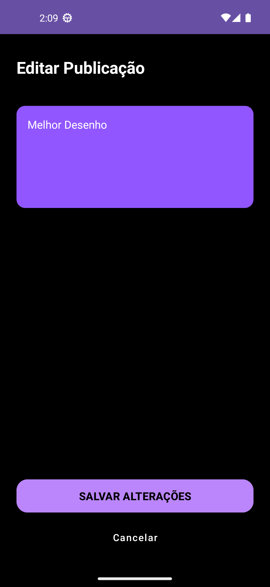
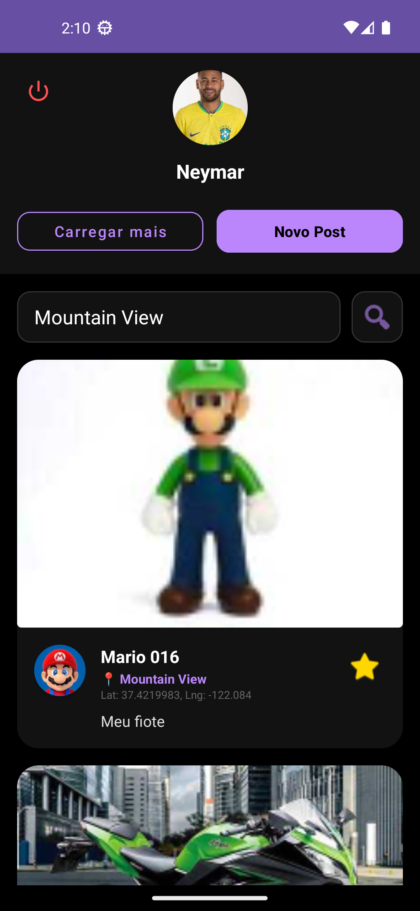

# 📱 MicroRedeSocial Konekt

Aplicativo Android de rede social desenvolvido como projeto prático da disciplina de Desenvolvimento Mobile no IFSP – Araraquara.


---

## 📋 Descrição

O **Konekt** é um aplicativo de feed social onde usuários podem criar posts com texto, imagem e localização GPS, além de editar seu perfil e interagir com a comunidade. O projeto utiliza autenticação real, persistência em nuvem via Firestore e carregamento de imagens com Glide.

---

## ✨ Funcionalidades

- 🔐 **Autenticação** — cadastro e login por e-mail/senha via Firebase Auth
- 📝 **Posts** — criar, editar e excluir posts com texto e imagem
- 📍 **Localização** — vincula automaticamente a cidade ao post via GPS
- 👤 **Perfil** — editar nome, username, foto de perfil e senha
- 🖼 **Upload de imagem** — seleção da galeria, armazenamento via Firebase Storage e carregamento com Glide
- 📷 **Feed** — lista de posts em tempo real via Firestore

---

## 📸 Demonstração

> 🎥 [Clique aqui para assistir ao vídeo — YouTube](https://www.youtube.com/watch?v=ibzgmktFr0I)

| Login | Cadastro | Home |
|-------|----------|------|
|  |  |  |

| Posts | Editar | Pesquisas |
|-------|--------|-----------|
|  |  |  |

---

## 🛠 Tecnologias Utilizadas

| Tecnologia | Uso |
|---|---|
| Kotlin | Linguagem principal |
| Android Studio | IDE de desenvolvimento |
| Firebase Auth | Autenticação de usuários |
| Firebase Firestore | Banco de dados em nuvem |
| Firebase Storage | Armazenamento de imagens |
| ViewBinding | Acesso seguro às views |
| RecyclerView + Adapter | Lista de posts |
| Material3 | Design system e componentes visuais |
| Glide | Carregamento e cache de imagens |
| FusedLocationProvider | Obtenção de localização GPS |
| Geocoder | Conversão de coordenadas em nome de cidade |
| Base64 | Fallback de armazenamento de imagens |
| ActivityResultContracts | Permissões e galeria em runtime |

---

## 🏗 Arquitetura

```
br.com.igor.microredesocial
├── adapter/        → PostAdapter (RecyclerView)
├── controller/     → AuthController, PostController, UserController
├── dao/            → PostDAO, UserDAO (interfaces Firestore)
├── helper/         → Base64Converter, LocationController
├── model/          → Post, User (data classes)
└── view/           → Activities (MainActivity, HomeActivity, SignUpActivity,
                       CreatePostActivity, EditarPostActivity, ProfileActivity)
```

---

## 🚀 Instalação

```bash
git clone https://github.com/Ralha-igor/Minha-Rede-Social.git
cd Minha-Rede-Social
```

1. Abra o projeto no **Android Studio**
2. Adicione seu arquivo `google-services.json` em `app/` (obtido no Firebase Console)
3. No Firebase, ative:
   - **Authentication** (e-mail/senha)
   - **Firestore Database**
   - **Storage**
4. Configure as regras do Firestore:

```js
rules_version = '2';
service cloud.firestore {
  match /databases/{database}/documents {
    match /users/{userId} {
      allow list: if true;
      allow get: if request.auth != null;
      allow write: if request.auth != null && request.auth.uid == userId;
    }
    match /posts/{postId} {
      allow read: if request.auth != null;
      allow create: if request.auth != null
                    && request.resource.data.userId == request.auth.uid;
      allow update, delete: if request.auth != null
                            && request.auth.uid == resource.data.userId;
    }
  }
}
```

5. Execute em um emulador ou dispositivo físico (**API 33+**)

---

## 📚 Aprendizados e Desafios

- Integração de **Firebase Storage** para upload e recuperação de imagens de perfil e posts
- Uso de **ActivityResultContracts** para seleção de imagens da galeria e permissões em runtime
- Gerenciamento de permissão de localização com **FusedLocationProvider** e **Geocoder**
- Carregamento eficiente de imagens com **Glide** (cache, placeholder, fallback)
- Reautenticação antes de operações sensíveis no Firebase Auth (`updatePassword`)
- Arquitetura separando responsabilidades entre `view`, `controller` e `dao`

---

## 👤 Sobre Mim

Desenvolvido por **Igor Ralha Guerreiro Gomes** — estudante de Análise e Desenvolvimento de Sistemas no IFSP – Araraquara.

📫 [LinkedIn](https://www.linkedin.com/in/SEU_LINKEDIN) · [GitHub](https://github.com/Ralha-igor)
